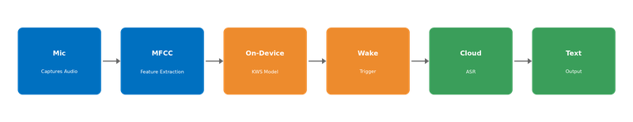

# SIH26172 — Low Latency Voice Activator for Edge Devices


A fully open-source, custom-trainable keyword-spotting system that runs entirely on-device within a strict resource budget, with an efficient handoff to cloud-based transcription only after a genuine wake event.

Built for **Smart India Hackathon 2026**, Problem Statement **SIH26172**, sponsored by **ISRO** (Theme: Smart Automation).

---

## The Problem

Voice-controlled IoT is everywhere, but processing every utterance in the cloud means constant audio streaming — expensive bandwidth, real privacy exposure, and latency on every interaction. Commercial wake-word engines solve part of this, but they're closed-source and vendor-locked: you can't audit what they're doing on-device, and you can't freely choose your own keyword.

## Our Solution

An open, self-trainable wake-word detector, engineered to a hard footprint budget on real hardware — not a simulated estimate — paired with an efficient edge-to-cloud handoff that only activates after true wake-word detection.

## Architecture



| Stage | What it does |
|---|---|
| **Mic** | INMP441 I2S MEMS microphone captures raw audio |
| **MFCC** | On-device feature extraction |
| **On-Device Model** | Quantized DS-CNN-class keyword-spotting model, running within a 256KB RAM / 10% idle-CPU budget |
| **Wake Trigger** | Fires only on the trained custom keyword ("TALOS") |
| **Cloud ASR** | Buffered audio streams to a self-hosted Whisper instance for full transcription |
| **Text Output** | Transcribed result returned |

## Tech Stack

- **Hardware:** ESP32 (WROOM-32), INMP441 I2S MEMS microphone
- **On-device ML:** TensorFlow Lite for Microcontrollers, trained via Edge Impulse
- **Feature extraction:** MFCC
- **ASR:** Self-hosted Whisper (open-source, no vendor API dependency)
- **Firmware:** Arduino / ESP-IDF

## Why This Approach

- **No vendor lock-in** — every layer of the stack is open-source and auditable, unlike commercial wake-word engines
- **Custom keyword, not a fixed set** — trainable on any keyword the deployment needs
- **Proven on real hardware** — footprint numbers, once finalized, come from on-device profiling, not simulation

## Results So Far

Trained and validated in Edge Impulse on a 3-class problem (keyword vs. background noise vs. other speech). Full breakdown, dataset composition, and known limitations are documented in [`MODEL_CARD.md`](MODEL_CARD.md).

| Model version | Accuracy | TALOS recall | Noise recall | TALOS F1 |
|---|---|---|---|---|
| Float32 (training) | 94.7% | 87.2% | 96.5% | 0.86 |
| **Quantized int8 (deployable)** | **92.0%** | **91.1%** | **93.0%** | **0.92** |

The quantized model above is what will actually run on the ESP32. On-device flash size, RAM usage, and live inference latency are still being measured on real hardware — see Project Status below. We're deliberately not publishing simulated/estimated footprint numbers as if they were measured; that distinction matters to us as much as the result itself.

## Repository Structure

```
├── firmware/          # ESP32 firmware (audio capture, inference, wake-trigger logic)
│   ├── src/
│   └── include/
├── models/            # Exported/quantized Edge Impulse models
├── docs/              # Architecture diagrams, research notes, references
├── MODEL_CARD.md       # Dataset composition, training results, known limitations
└── README.md
```

## Project Status

This project is being actively built as part of SIH 2026. Current stage:

- [x] Problem statement analysis and architecture design
- [x] Hardware selection (ESP32 + INMP441)
- [x] Custom keyword dataset collected (TALOS, noise, unknown — see `MODEL_CARD.md`)
- [x] Initial model trained and validated in Edge Impulse (92% quantized accuracy)
- [ ] Raw audio capture verified on hardware
- [ ] On-device deployment and live wake-detection test
- [ ] Footprint validated against 256KB / 10% CPU budget (real hardware measurement, not estimate)
- [ ] Cloud ASR handoff integrated

## Team — Caffeine Addicts

| Name | Role |
|---|---|
| Jishnu Vardhan (Richu) | Team Lead — embedded firmware, model training & deployment |
| Chaitanya Kumar | Backend & cloud ASR integration |
| Manasvini | Deck design & documentation |
| Mannu Kumar | Visualization & demo tooling |
| Nethra | Evidence, validation & dataset collection |
| Shourya Singh | Research — existing-solutions analysis |

## References

See [`docs/references.md`](docs/references.md).

## License

MIT — see [LICENSE](LICENSE). Chosen deliberately: an open, auditable license is part of this project's own pitch.
